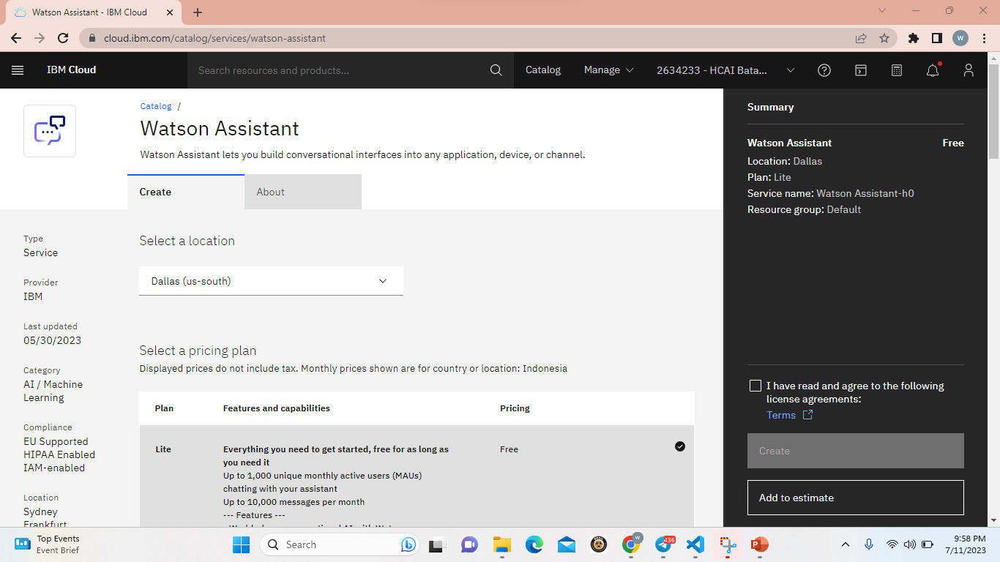 
Langkah pertama yang dilakukan untuk membuat chatbot adalah install service yaitu watson assistant dengan memilih lokasi Dallas setelah itu klik create
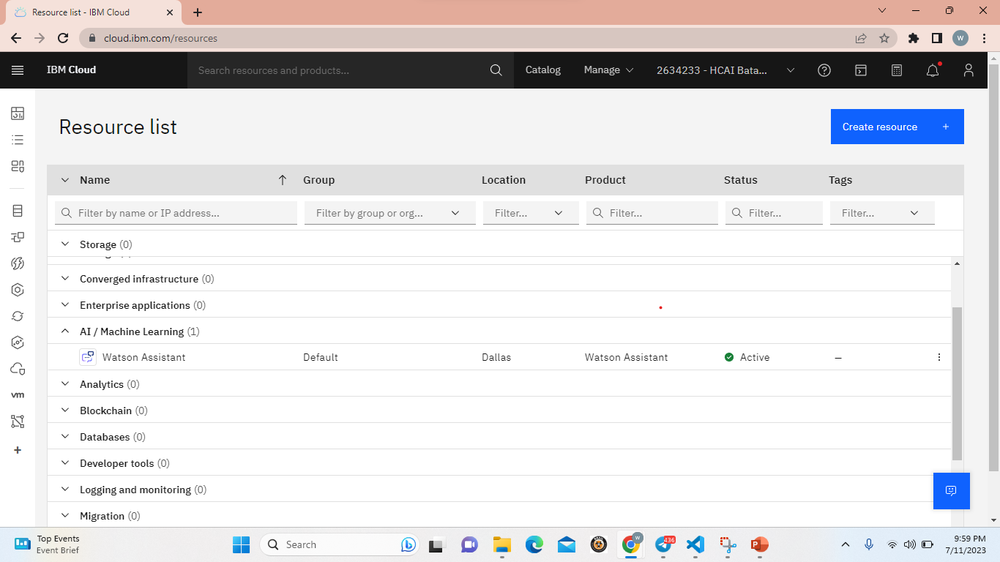 
Setelah itu klik Resource List untuk ngelihat service yang sudah di install, klik Watson Assistant untuk membuat chatbot
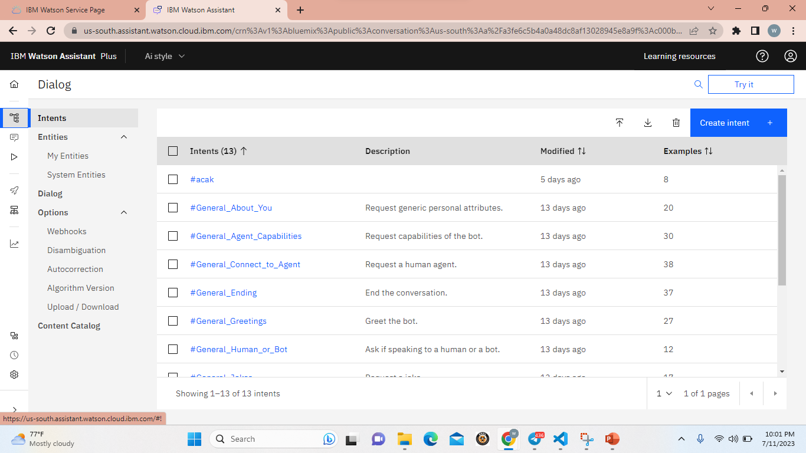 
Untuk membuat chatbot, pertama menambahkan intents untuk menambahkan pertanyaan yang ditanyakan di chatbot
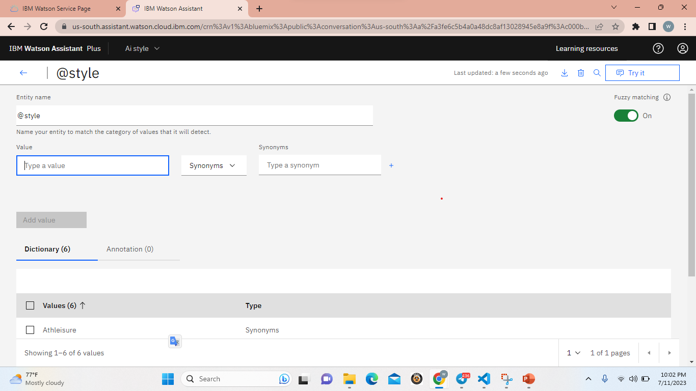
Selanjutnya, menambahkan Entities untuk menambahkan style-style yang tersedia.
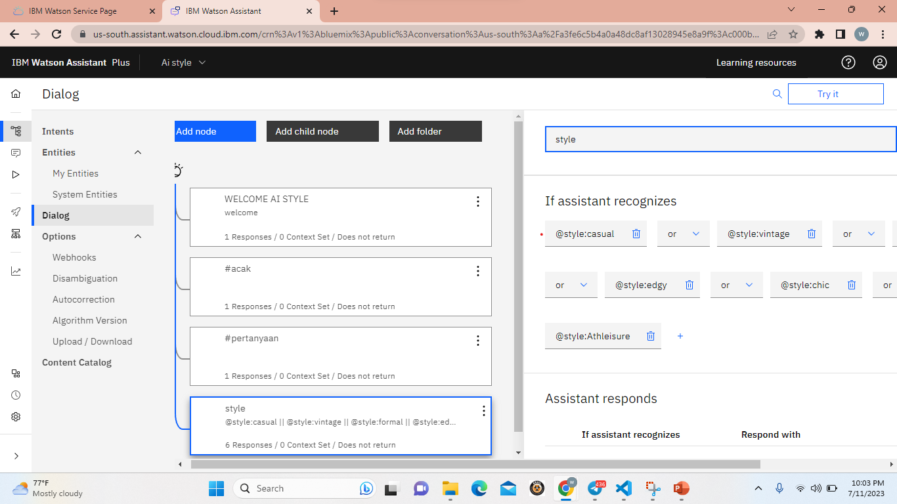
Setelah menambahkan intents dan entities selanjutnya membuat dialog dengan menambahkan kondisi di dialog tersebut dengan logika or 
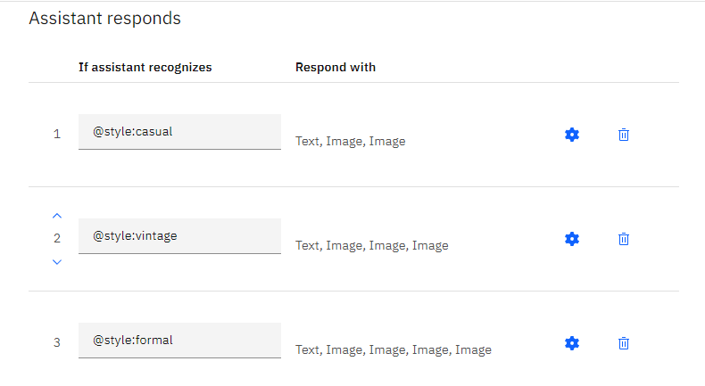
Masukkan kondisi di assistant respond untuk menambahkan responnya yaitu text dan image
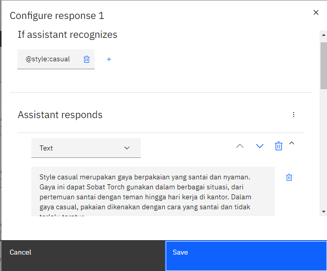
Tambahkan text sesuai dengan kondisi yang dipilih
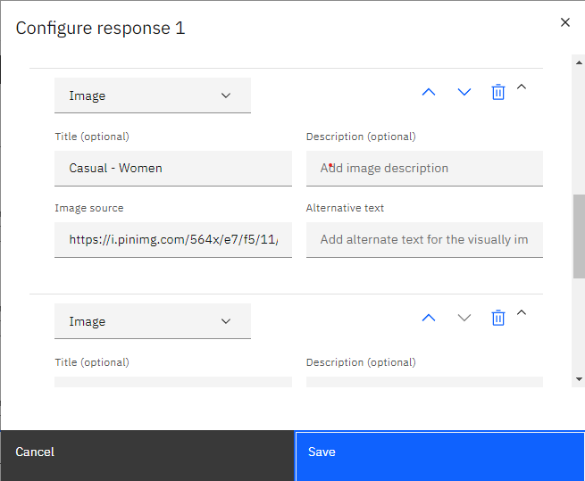
Tambahkan gambar melalui link, setelah itu klik save.
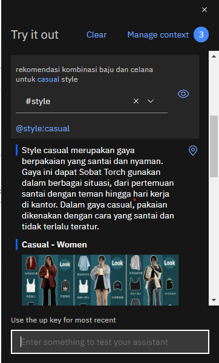
Pada gambar ini adalah contoh chatbot dengan pertanyaan yang telah di masukkan ke dalam intents dan etities.
 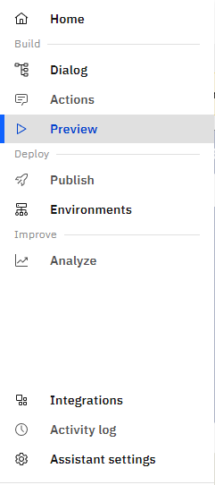
 Untuk menambahkan chatbot di tampilan website yang telah dibuat tambahkan script yang ada di preview > embed
 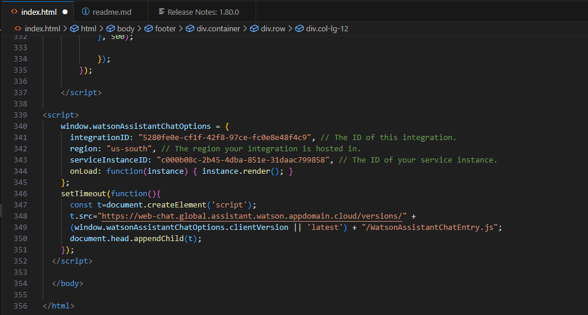
 Salin code yang ada di embed ke dalam file html website.
  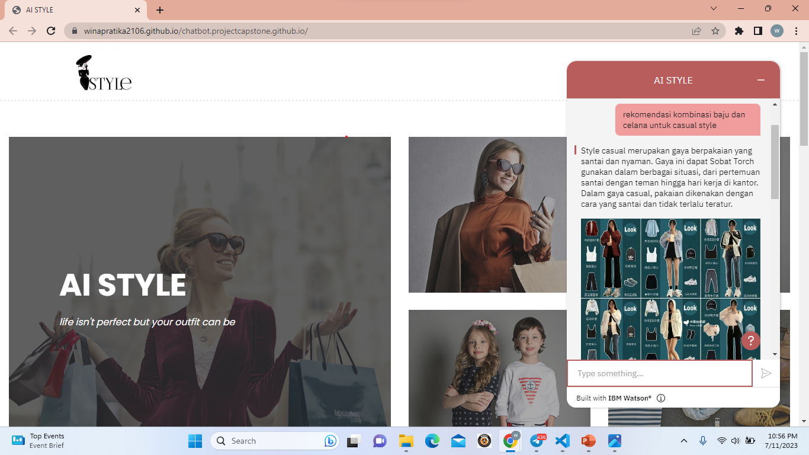
  Berikut tampilan chatbot pada website.